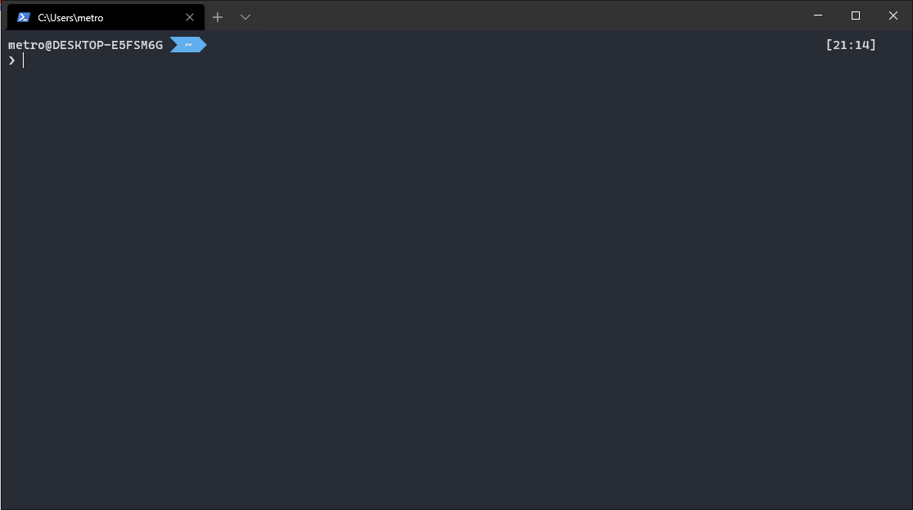

<!--
*** Thanks for checking out this README Template. If you have a suggestion that would
*** make this better, please fork the MemberAnalyzer and create a pull request or simply open
*** an issue with the tag "enhancement".
*** Thanks again! Now go create something AMAZING! :D
***
***
***
*** To avoid retyping too much info. Do a search and replace for the following:
*** Yuan-Quan, MemberAnalyzer, twitter_handle, metroyuan@gmail.com
-->


<!-- PROJECT SHIELDS -->
<!--
*** I'm using markdown "reference style" links for readability.
*** Reference links are enclosed in brackets [ ] instead of parentheses ( ).
*** See the bottom of this document for the declaration of the reference variables
*** for contributors-url, forks-url, etc. This is an optional, concise syntax you may use.
*** https://www.markdownguide.org/basic-syntax/#reference-style-links
-->
[![Contributors][contributors-shield]][contributors-url]
[![Forks][forks-shield]][forks-url]
[![Stargazers][stars-shield]][stars-url]
[![Issues][issues-shield]][issues-url]
[![MIT License][license-shield]][license-url]
<!--[![LinkedIn][linkedin-shield]][linkedin-url]-->


<!-- PROJECT LOGO -->
<br />
<p align="center">
  <a href="https://github.com/Yuan-Quan/MemberAnalyzer">
    
  </a>

  <h3 align="center">MEMBER ANALYZER</h3>

  <p align="center">
    昆明八中音乐社用 提取qq群成员信息. 分析群名片以分类群成员
    <br />
    <a href="https://github.com/Yuan-Quan/MemberAnalyzer"><strong>Explore the docs »</strong></a>
    <br />
    <br />
    <a href="https://github.com/Yuan-Quan/MemberAnalyzer">View Demo</a>
    ·
    <a href="https://github.com/Yuan-Quan/MemberAnalyzer/issues">Report Bug</a>
    ·
    <a href="https://github.com/Yuan-Quan/MemberAnalyzer/issues">Request Feature</a>
  </p>
</p>


<!-- TABLE OF CONTENTS -->
## Table of Contents

* [About the Project](#about-the-project)
  * [Built With](#built-with)
* [Getting Started](#getting-started)
  * [Prerequisites](#prerequisites)
  * [Installation](#installation)
* [Usage](#usage)
* [Roadmap](#roadmap)
* [Contributing](#contributing)
* [License](#license)
* [Contact](#contact)
* [Acknowledgements](#acknowledgements)


<!-- ABOUT THE PROJECT -->
## About The Project

[![Product Name Screen Shot][product-screenshot]](https://example.com)

**音乐社人太多了, 手动统计社员名单会死的**

### Built With

* [CommandDotnet](https://github.com/bilal-fazlani/commanddotnet/)
* [ConsoleTables](https://github.com/khalidabuhakmeh/ConsoleTables)
* [.NetCore 3.1](https://github.com/dotnet/core)


<!-- GETTING STARTED -->
## Getting Started

获得一份此程序的副本, 并在自己的设备上运行起来.

### Prerequisites

*需要先安装.NetCore 3.1的运行环境
  
__[下载运行环境](https://dotnet.microsoft.com/download)__
  
下载完了吗? 安装好了吗? 我等你...
  
*需要一个终端来进行指令行下的操作
选一个自己喜欢的就行, 什么powershell, gitbash都可以  
以powershell为例，按下windows+x键, 点击Windows Powershell即可打开

之后需要在这个黑框框里敲指令

### Installation Guide for Windows
  
#### Get a copy of this app
[下载最新版本的本程序](https://github.com/Yuan-Quan/MemberAnalyzer/releases)

#### Deploy
解压到你喜欢的目录.  

记下这个文件夹所在的路径, 在本例中是```C:\win-x64\```
为使得在任何目录都可以使用, __请把本文件夹的地址加入PATH环境变量__
计算机->右键->属性->高级系统设置, 在高级选项卡下， 有环型变量选项

把刚刚记下的路径添加进去, 确定后重新启动Powershell

 
安装成功之后, 在你的终端中键入 
```bash 
$ MemberAnalyzer.exe 
``` 
应该会出现帮助的内容:
```
Usage: MemberAnalyzer.exe [command] [options]

Options:

  -v | --version
  Show version information

Commands:

  clean          preserve profiles only of current grade
  completeAlias  complete Alias using a given file
  completeInfo   complete informations using content of alias
  config         view change/add settings
  deserialize    Deserialize text copid from QQ web, then serialize them into a xml file
  print          print the contnet of a xml file.

Use "MemberAnalyzer.exe [command] --help" for more information about a command.
```
如果没有, 就是环境变量不正确

## Usage

### 生成xml文件

登录QQ群官网的成员管理页面  
用这个地址
```
https://qun.qq.com/member.html#gid=群号
```
"群号"替换成群号


像这样把全部人都选中, 然后复制粘贴到一个文本文档里面

暂且把它叫做```raw.txt```

我把这个文件放在了桌面, 所以使用:
```bash
cd Desktop
```
把工作目录切换到桌面
  
使用本程序的 ```deserialize -f [path]``` 命令以解析这个文件  
在本例中:
```bash
$ MemberAnalyzer.exe deserialize -f raw.txt

>text file deserialized successfully!!
>
>Saved your file to C:\Users\metro\Desktop\Members.xml
```
然后桌面上就多出了一个Members.xml
  
如图, 成功生成解析后的xml文件,内容大概是这样的


这个文件可以直接用Excel打开


### 补全群名片

获取群名片的纯文本, 可以使用QQ截图的文字提取

把他们存到一个纯文本文件里, 一个一行

我把它命名为```alias.txt```
  
使用```completeAlias -f [xml文件] -s [群名片文件]```补全群名片

```bash
MemberAnalyzer.exe completeAlias -f Members.xml -s alias.txt
```

显示Match failed!!匹配失败需要手动编辑xml文件来补全群名片

### 过滤掉非23届的群员

在过滤之前要先补全所有信息
```bash
MemberAnalyzer.exe completeInfo -f Members.xml
```
群名片不规范的无法自动获取届数, 需要手动补全
  
使用
```bash
MemberAnalyzer.exe print table -f Members.xml
```
查看内容, 确保届数等段都填写完整了

需要一个黑名单文件以过滤掉群名片设置23届但并不是23届同学
需要屏蔽的人的QQ号, 一行一个
例如 ```23届李昊丰想学电音``` 显然不是23届的, 把他的qq号放入黑名单文件

我命名为```blaclist.txt```

运行
```bash
MemberAnalyzer.exe clean -f Members.xml --blacklist blacklist.txt
```

现在, 仅有群名片正确的23届同学在名单中


<!-- ROADMAP -->
## Roadmap

See the [open issues](https://github.com/Yuan-Quan/MemberAnalyzer/issues) for a list of proposed features (and known issues).


<!-- CONTRIBUTING -->
## Contributing

Contributions are what make the open source community such an amazing place to be learn, inspire, and create. Any contributions you make are **greatly appreciated**.

1. Fork the Project
2. Create your Feature Branch (`git checkout -b feature/AmazingFeature`)
3. Commit your Changes (`git commit -m 'Add some AmazingFeature'`)
4. Push to the Branch (`git push origin feature/AmazingFeature`)
5. Open a Pull Request


<!-- LICENSE -->
## License

Distributed under the General Public License. See `LICENSE` for more information.


<!-- CONTACT -->
## Contact

袁泉 - [@twitter_handle](https://twitter.com/twitter_handle) - metroyuan@gmail.com

Project Link: [https://github.com/Yuan-Quan/MemberAnalyzer](https://github.com/Yuan-Quan/MemberAnalyzer)


<!-- ACKNOWLEDGEMENTS -->
## Acknowledgements

* [额]()
* [没了]()
* [你走吧]()


<!-- MARKDOWN LINKS & IMAGES -->
<!-- https://www.markdownguide.org/basic-syntax/#reference-style-links -->
[contributors-shield]: https://img.shields.io/github/contributors/Yuan-Quan/MemberAnalyzer.svg?style=flat-square
[contributors-url]: https://github.com/Yuan-Quan/MemberAnalyzer/graphs/contributors
[forks-shield]: https://img.shields.io/github/forks/Yuan-Quan/MemberAnalyzer.svg?style=flat-square
[forks-url]: https://github.com/Yuan-Quan/MemberAnalyzer/network/members
[stars-shield]: https://img.shields.io/github/stars/Yuan-Quan/MemberAnalyzer.svg?style=flat-square
[stars-url]: https://github.com/Yuan-Quan/MemberAnalyzer/stargazers
[issues-shield]: https://img.shields.io/github/issues/Yuan-Quan/MemberAnalyzer.svg?style=flat-square
[issues-url]: https://github.com/Yuan-Quan/MemberAnalyzer/issues
[license-shield]: https://img.shields.io/github/license/Yuan-Quan/MemberAnalyzer.svg?style=flat-square
[license-url]: https://github.com/Yuan-Quan/MemberAnalyzer/blob/master/LICENSE.txt
[linkedin-shield]: https://img.shields.io/badge/-LinkedIn-black.svg?style=flat-square&logo=linkedin&colorB=555
[linkedin-url]: https://linkedin.com/in/Yuan-Quan
[product-screenshot]: images/screenshot.png
